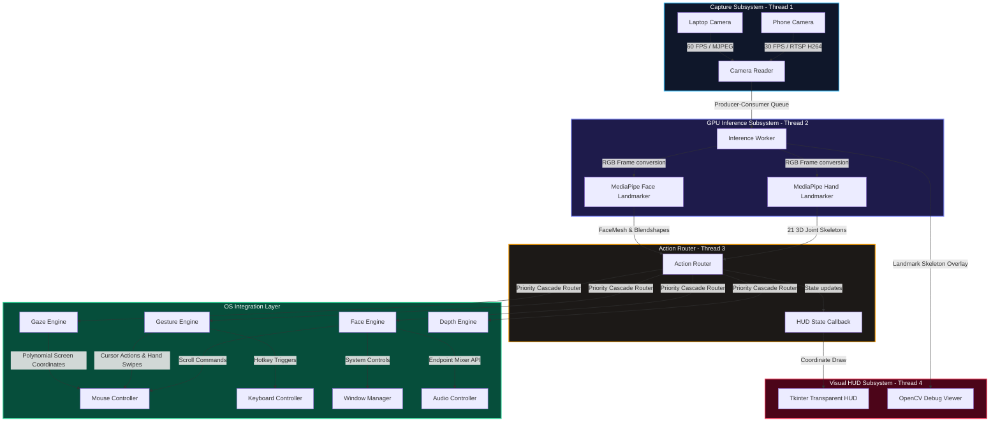
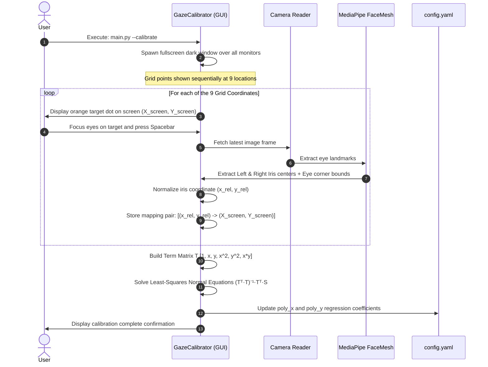
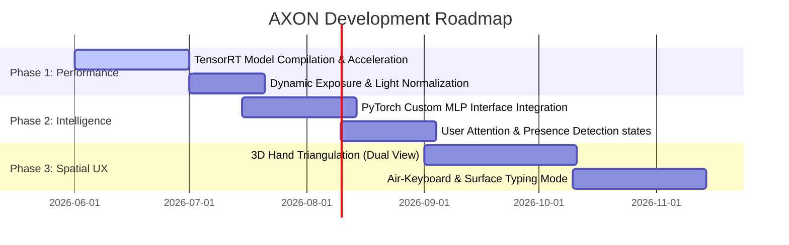

```
  █████╗ ██╗  ██╗ ██████╗ ███╗   ██╗
 ██╔══██╗╚██╗██╔╝██╔═══██╗████╗  ██║
 ███████║ ╚███╔╝ ██║   ██║██╔██╗ ██║
 ██╔══██║ ██╔██╗ ██║   ██║██║╚██╗██║
 ██║  ██║██╔╝ ██╗╚██████╔╝██║ ╚████║
 ╚═╝  ╚═╝╚═╝  ╚═╝ ╚═════╝ ╚═╝  ╚═══╝
                                                      
     Adaptive eXpression & Optical Navigation System
```

> **"The physical keyboard and mouse are remnants of a mechanical age. AXON is the digital synapse—converting your eyes, face, and hands directly into operating system instructions, locally and in real-time."**

---

## 🌌 Project Abstract & Vision

**AXON** is an advanced, zero-touch, zero-cloud human-computer interaction (HCI) environment. It turns a standard workspace—consisting of a laptop, an external monitor, and a smartphone camera—into a multi-modal spatial computing station. By running optimized computer vision pipelines and deep learning classification models directly on local consumer hardware (GPU-delegated RTX 2050), AXON bridges the physical-digital divide.

Traditional input systems rely on tactile feedback. AXON replaces this with optical biometric monitoring:
*   **Gaze Navigation**: Follows iris movements across a multi-display layout using a 2nd-degree polynomial mapping matrix.
*   **Manual Kinematics**: Decodes hand skeletons to navigate cursors, drag windows, pinch-zoom, and execute commands.
*   **Facial Biometrics**: Translates head nods, shakes, rolls, eyebrow raises, smiles, and jaw movements into system-level hotkeys, scrolls, and media controls.
*   **Dual-Camera Triangulation**: Computes hand depth relative to the screen axis using stereo triangulation from two viewpoints.

AXON operates entirely offline, keeping your biometric data private on your own machine.

---

## ⚡ Technical Stack & Dependency Matrix

The table below outlines the library stack, purpose, and version requirements used in the AXON control architecture:

| Library / Module | Minimum Version | Target Purpose / Mechanics | Acceleration / Subsystem |
| :--- | :--- | :--- | :--- |
| **`python`** | `3.10` | Core Execution Engine | CPU / Windows Runtime |
| **`mediapipe`** | `0.10.14` | Local face landmarker, blendshape output, and hand landmark tracking | GPU (CUDA / Direct3D Delegate) |
| **`opencv-python`** | `4.8.0.0` | Frame decoding, RTSP stream ingestion, debug drawings | CPU (OpenCV Core) |
| **`torch`** | `2.0.0` | Custom MLP gesture classifier inference and training | CPU / CUDA (RTX 2050) |
| **`torchvision`** | `0.15.0` | Future image-based posture analysis | CPU / GPU |
| **`pyautogui`** | `0.9.54` | Absolute fallback cursor control and scrolling | Windows USER32 Subsystem |
| **`pynput`** | `1.8.0` | Low-latency system keyboard injection and hotkey orchestration | Windows Hook Subsystem |
| **`pygetwindow`** | `0.0.9` | Windows desktop geometry query, coordinate mapping, and resizing | Windows Dwmapi / User32 API |
| **`pycaw`** | `20230407` | Core Audio endpoints, endpoint volume rendering interfaces | WASAPI (Windows Audio Session API) |
| **`screeninfo`** | `0.8.1` | Multi-monitor layout discovery and pixel coordinates | Windows GDI Engine |
| **`pywin32`** | `306` | Native win32gui/win32process hooks for window controls | Win32 API |
| **`numpy`** | `1.24.0` | Linear algebra operations, polynomial regression, vector maths | CPU (BLAS/LAPAC vectorization) |
| **`scipy`** | `1.10.0` | Multi-dimensional spatial distances, optimization solvers | CPU |
| **`PyYAML`** | `6.0` | Config parser for threshold limits and regression coefficients | Local Disk Storage |

---

## 📐 System Topology & Data Flow Architectures

AXON operates on a high-throughput, multi-threaded pipeline designed to prevent frame bottlenecking and ensure consistent execution.

### 1. Global Processing Pipeline & Thread Boundaries



### 2. Gaze Calibration Engine Routing



---

## 📈 Functional Controls & Priority Mapping

To prevent overlapping actions from triggering concurrently (e.g. scrolling while drawing, or clicking while adjusting audio), the **Action Router** filters inputs through the following control hierarchy:

| Input Modality | Physical Movement / Pose | Classification Rule / Value | Triggered OS Action | Cooldown / Dwell | Target API |
| :--- | :--- | :--- | :--- | :--- | :--- |
| **Hand** | Right hand open palm | Fingers extended, distance > threshold | **Toggle Freeze Mode** (Locks all tracking) | Held for 2000 ms | Internal State |
| **Hand** | Right index finger extended | Index Tip extended, others flexed | **Air Mouse cursor tracking** | Continuous (EMA smoothed) | `pynput.mouse` |
| **Hand** | Right index-thumb pinch | Tip distance < 0.05 normalized | **Left Mouse Click & Drag** | Continuous hold | `pynput.mouse` |
| **Hand** | Both hands open palms | Multiple hand skeletons detected | **Clear Air-Drawing Whiteboard** | Immediate trigger | HUD Canvas |
| **Hand** | Right wrist fast horizontal motion | Velocity > 800 px/s | **Switch Virtual Desktop (Left/Right)** | Cooldown: 800 ms | Windows hotkey |
| **Hand** | Right index & middle fingers up | index/middle extended, others flexed | **Toggle Whiteboard Canvas Mode** | Held for 1500 ms | HUD Canvas |
| **Hand** | Right hand making fist | All fingers flexed | **Dwell Start** for Play/Pause trigger | Held for 200 ms | Internal Timer |
| **Hand** | Right hand thumb pointing up | Thumb extended up, others flexed | **Master Volume Increase** | Cooldown: 200 ms | `pycaw.WASAPI` |
| **Hand** | Right hand thumb pointing down | Thumb extended down, others flexed | **Master Volume Decrease** | Cooldown: 200 ms | `pycaw.WASAPI` |
| **Eye** | Left eye wink | Left eye closed (>0.65), right eye open (<0.35) | **Left Mouse Click** | Cooldown: 500 ms | `pynput.mouse` |
| **Eye** | Right eye wink | Right eye closed (>0.65), left eye open (<0.35) | **Right Mouse Click** | Cooldown: 500 ms | `pynput.mouse` |
| **Face** | Head roll (tilt to side) | Roll angle > 15 degrees | **Scroll Active Window (Up/Down)** | Continuous | Windows Scroll API |
| **Face** | Head shake (horizontal turn) | Yaw velocity > 150 deg/s | **Close Active Window (Alt+F4)** | Cooldown: 1500 ms | `pygetwindow` |
| **Face** | Head nod (vertical drop) | Pitch velocity > 120 deg/s | **Confirm Action (Enter Key)** | Cooldown: 1500 ms | `pynput.keyboard` |
| **Face** | Eyebrow raise (looking left) | Brow outer up > 0.40 & Iris X < 0.43 | **Web Browser Back Navigation** | Cooldown: 1500 ms | `pynput.keyboard` |
| **Face** | Eyebrow raise (looking right) | Brow outer up > 0.40 & Iris X > 0.57 | **Web Browser Forward Navigation** | Cooldown: 1500 ms | `pynput.keyboard` |
| **Face** | Mouth open wide | Jaw open score > 0.40 | **Trigger OS Voice Assistant (Win+H)** | Held for 300 ms | Windows hotkey |
| **Face** | Smiling | Smile blendshape score > 0.48 | **Capture Screenshot** | Held for 1500 ms | Windows Screen API |
| **Gaze & Head** | Look at other screen + Nod | Gaze crosses display boundary | **Move Active Window to adjacent monitor** | Immediate on nod | Win32 API |

---

## 🔬 Mathematical Foundations & Signal Processing

### 1. Bivariate Polynomial Gaze Mapping
Linear gaze mapping does not account for the curvature of the eyes or screen tilt. To solve this, AXON fits a 2nd-degree polynomial mapping function to the user's eye movements.
For a given relative iris position $(x, y)$, the predicted screen coordinates $(X_{screen}, Y_{screen})$ are calculated as:

$$X_{screen} = \beta_{x0} + \beta_{x1}x + \beta_{x2}y + \beta_{x3}x^2 + \beta_{x4}y^2 + \beta_{x5}xy$$

$$Y_{screen} = \beta_{y0} + \beta_{y1}x + \beta_{y2}y + \beta_{y3}x^2 + \beta_{y4}y^2 + \beta_{y5}xy$$

We represent this as a matrix multiplication:

$$\vec{S} = \mathbf{T} \vec{\beta}$$

Where:
*   $\vec{S}$ is the vector of screen positions ($[X_{screen}]$ or $[Y_{screen}]$).
*   $\mathbf{T}$ is the term matrix constructed from the normalized coordinates:

$$\mathbf{T} = \begin{bmatrix} 1 & x_1 & y_1 & x_1^2 & y_1^2 & x_1 y_1 \\ 1 & x_2 & y_2 & x_2^2 & y_2^2 & x_2 y_2 \\ \vdots & \vdots & \vdots & \vdots & \vdots & \vdots \\ 1 & x_n & y_n & x_n^2 & y_n^2 & x_n y_n \end{bmatrix}$$

Using the collected 9-point data, we solve for $\vec{\beta}$ using the normal equation:

$$\vec{\beta} = (\mathbf{T}^T \mathbf{T})^{-1} \mathbf{T}^T \vec{S}$$

This gives us the coefficients needed to map iris movements to screen coordinates.

### 2. Exponential Moving Average (EMA) Cursor Smoothing
To filter out hand tremors while keeping the cursor responsive, index finger coordinates are smoothed using a dynamically weighted EMA:

$$X_{smoothed}^{[t]} = \alpha \cdot X_{raw}^{[t]} + (1 - \alpha) \cdot X_{smoothed}^{[t-1]}$$

*Where $\alpha$ (configured in `config.yaml` as `cursor_ema_alpha`) balances response time and cursor stability.*

### 3. Numerical Differentiation for Gesture Velocity
To detect quick movements like swipes or nods, AXON calculates joint velocity using a central difference method over a sliding buffer of coordinates:

$$V^{[t]} = \frac{X^{[t]} - X^{[t-k]}}{t - t_{k}}$$

This velocity estimate is then compared against preset thresholds (such as `swipe_velocity_threshold` or `nod_velocity_threshold`) to trigger actions.

### 4. Stereo Depth Triangulation
When using a second camera, the **Depth Engine** estimates hand distance by measuring the disparity of wrist landmarks between the two views.
Using a simplified stereo setup where the second camera is placed at a known baseline distance $B$ along the horizontal axis, the depth $Z$ is calculated as:

$$Z = \frac{f \cdot B}{d}$$

Where:
*   $f$ is the camera's focal length.
*   $d$ is the disparity ($x_{left} - x_{right}$), representing the difference in the wrist's horizontal position between the two camera views.

---

## 💻 Codebase Deep-Dive & Module Guide

### `axon/core/` (Pipeline Core)
*   **[`camera.py`](file:///d:/AXON/axon/core/camera.py)**: Spawns two independent reading threads. Read buffers are locked using `threading.Lock` to ensure the inference worker always receives the latest frames. Includes an exponential backoff routine to handle network interruptions for RTSP cameras.
*   **[`inference.py`](file:///d:/AXON/axon/core/inference.py)**: Manages the lifetime of the MediaPipe models. Configured to run in video mode, matching frame timestamps to prevent tracking drift. If the GPU delegate fails to load, it automatically falls back to CPU execution.
*   **[`action_router.py`](file:///d:/AXON/axon/core/action_router.py)**: The central hub of the system. It receives landmark results, runs the classification engines, checks the active mode (Freeze, Draw, or Normal), and executes the corresponding OS commands.

### `axon/engines/` (Processing Engines)
*   **[`gaze_engine.py`](file:///d:/AXON/axon/engines/gaze_engine.py)**: Tracks eye movements. Uses MediaPipe face blendshapes to get blink and wink scores. Estimates head rotation (pitch, yaw, roll) by matching 3D facial landmarks to a standard model using OpenCV's `solvePnP`.
*   **[`gesture_engine.py`](file:///d:/AXON/axon/engines/gesture_engine.py)**: Hand skeleton tracking. Normalizes joint distances relative to hand size to keep tracking consistent at different distances. Projects index finger coordinates to screen space and tracks hand velocity to detect swipes.
*   **[`face_engine.py`](file:///d:/AXON/axon/engines/face_engine.py)**: Evaluates facial expressions. Monitors yaw and pitch velocities to detect head shakes and nods. Uses eye movements and eyebrow raises to trigger browser navigation.
*   **[`depth_engine.py`](file:///d:/AXON/axon/engines/depth_engine.py)**: Processes depth information. Computes hand depth from the secondary camera stream by measuring coordinate changes relative to the camera's field of view.

### `axon/control/` (OS Control Interface)
*   **[`mouse_controller.py`](file:///d:/AXON/axon/control/mouse_controller.py)**: Controls cursor movements and clicks. Coordinates are mapped across multi-monitor setups using absolute pixel coordinates.
*   **[`keyboard_controller.py`](file:///d:/AXON/axon/control/keyboard_controller.py)**: Simulates keyboard inputs and hotkeys.
*   **[`window_manager.py`](file:///d:/AXON/axon/control/window_manager.py)**: Interfaces with the Windows OS to manage applications. Automatically detects display boundaries, handles window snapping, and moves active windows between displays.
*   **[`audio_controller.py`](file:///d:/AXON/axon/control/audio_controller.py)**: Uses Windows core audio APIs to adjust the system volume.

### `axon/overlay/` (Visual Feedback HUD)
*   **[`hud.py`](file:///d:/AXON/axon/overlay/hud.py)**: Draws a transparent window on top of the OS interface using Tkinter. Displays a gaze pointer, status indicators, and an interactive canvas for whiteboard drawing.
*   **[`debug_view.py`](file:///d:/AXON/axon/overlay/debug_view.py)**: Opens an OpenCV window showing the camera feed with overlaid landmark skeletons. Useful for adjusting camera angles and checking detection status.

---

## 🛠️ Step-by-Step Configuration & Run Guide

### 1. Connecting Your Phone Camera via IP Webcam
1. Download **IP Webcam** on your Android or iOS device.
2. Connect both your phone and laptop to the same Wi-Fi network.
3. Open the app, adjust the video resolution (e.g., $640 \times 480$ at $30\text{ FPS}$), and select **Start Server**.
4. The app will display an access URL (e.g., `http://192.168.1.8:8080`).
5. Open `config.yaml` and set the RTSP address:
   ```yaml
   cameras:
     use_phone: true
     phone_rtsp_url: rtsp://192.168.1.8:8080/h264_ulaw.sdp
   ```

### 2. Setting Up the Environment
Open PowerShell inside the project directory:
```powershell
# Navigate to project root
cd d:\AXON

# Create a virtual environment
python -m venv venv

# Activate the virtual environment
.\venv\Scripts\Activate.ps1

# Install required packages
pip install -r requirements.txt

# Download model assets
python setup_models.py
```

### 3. Gaze Calibration
For accurate eye tracking, run the calibration utility:
```powershell
python main.py --calibrate
```
1. Position your laptop and sit in your normal working posture.
2. Focus on the screen and press **Spacebar** to begin.
3. Look at the target dot as it moves to 9 different locations across your displays, pressing **Spacebar** at each point.
4. The calculated calibration coefficients will save to `config.yaml` automatically. Press **Escape** to exit.

### 4. Running the System
Start AXON with the overlay HUD active:
```powershell
python main.py
```
To run in **Debug Mode** (opens a window showing real-time tracking overlays, hand skeletons, active gestures, and performance metrics):
```powershell
python main.py --debug
```

---

## 🧠 Custom Gesture Neural Network (MLP) Trainer

For actions beyond rule-based gestures, AXON includes a custom training pipeline using a PyTorch Multi-Layer Perceptron (MLP) model.

```mermaid
graph LR
    subgraph Data_Collection [1. Record Skeletons]
        Hand[21 Hand Landmarks] -->|Extract relative displacement| V_63[63-Dimensional Feature Vector]
        V_63 -->|Save 40 Frames| CSV[gesture_data.csv]
    end

    subgraph NN_Architecture [2. MLP Model]
        CSV -->|Input Layer: 63| FC1[Linear 128 + ReLU]
        FC1 --> FC2[Linear 64 + ReLU]
        FC2 --> Out[Output Layer: N Classes]
    end

    subgraph Export [3. Inference Integration]
        Out -->|Softmax Loss| Trainer[Adam Optimizer]
        Trainer -->|Save Weights| PT[gesture_classifier.pt]
        PT -->|Engine Load| Runtime[Runtime Gesture Evaluator]
    end

    style Data_Collection fill:#0f172a,stroke:#38bdf8,stroke-width:2px,color:#fff
    style NN_Architecture fill:#1e1b4b,stroke:#818cf8,stroke-width:2px,color:#fff
    style Export fill:#064e3b,stroke:#34d399,stroke-width:2px,color:#fff
```



### How to Train a Custom Gesture:
1. Start the training script and specify a name for the new gesture:
   ```powershell
   python -m axon.gestures.custom_trainer --name "SWIPE_DOWN"
   ```
2. Hold your hand in the target pose within the camera's view.
3. Press **Spacebar** to record. The script collects 40 frames of hand coordinates.
4. The script automatically trains a PyTorch MLP model on the recorded data and saves the model file to the gestures directory.

---

## 🔮 Future Development Roadmap

AXON is designed to scale from a basic mouse emulator to an immersive spatial computing environment.



### Roadmap Details:
1. **TensorRT Compilation**: Optimize the underlying models using NVIDIA TensorRT to achieve inference latency below $5\text{ ms}$ on local RTX GPUs.
2. **Light Normalization**: Add real-time image adjustment filters to improve iris tracking in low-light environments.
3. **MLP Integration**: Integrate the custom PyTorch gesture model directly into the main execution pipeline.
4. **Presence Sleep State**: Put displays to sleep or lock the system when no user is detected for more than 10 seconds.
5. **Air-Keyboard**: Map fingertip locations relative to flat surfaces to enable typing without physical keyboards.
